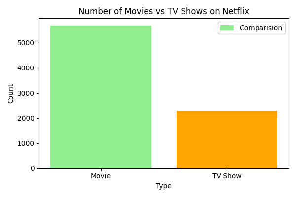

# 📊 Netflix Content Analysis (Python Project)

This project involves a comprehensive Exploratory Data Analysis (EDA) of the Netflix titles dataset from Kaggle, utilizing Python and its core data science libraries (Pandas, NumPy, and Matplotlib). The primary goal is to understand Netflix's content strategy, analyze the distribution of movies vs. TV shows, identify trends in content addition, and explore the diversity of genres and country-specific content.

---

## 🛠️ Tools & Libraries Used

* **Language:** `Python 3.x`
* **Data Analysis:** `Pandas` (For data cleaning, processing, and manipulation)
* **Numerical Computing:** `NumPy` (For numerical operations)
* **Data Visualization:** `Matplotlib` (For plotting insights derived from the analysis)
* **Environment:** `Jupyter Notebook`

---

## 📈 Analysis Process

1.  **Data Loading:** The `netflix_titles.csv` file from Kaggle was loaded into a Pandas DataFrame.
2.  **Data Cleaning:**
    * Handled missing values (`NaN`) in columns like `director` and `cast`.
    * Converted the `date_added` column to the correct `datetime` format.
    * Dropped irrelevant columns and prepared the dataset for analysis.
3.  **Exploratory Data Analysis (EDA):** Used Pandas to ask and answer key business questions.
4.  **Visualization:** Used Matplotlib to create plots and charts to present the findings for each question.

---

## 💡 Key Insights & Visualizations

This analysis yielded several key insights into the Netflix library:

### 1. Content Type (Movie vs. TV Show)
The Netflix library is predominantly composed of Movies, which significantly outnumber TV Shows.



### 2. Content Release Trend Over Time
There has been a dramatic increase in content added to Netflix over the years, with a significant boom observed post-2016.


### 3. Content by Country (Top 10)
Analysis of the top 10 countries that produce or host the most content on the platform. (e.g., United States, India, UK).


### 4. Netflix Content: Breakdown by Maturity Rating
Analysis the percentage breakdown of all content in the Netflix library by its official maturity rating.


---

## 🚀 How to Run This Project

To run this analysis yourself:

1.  Clone this repository to your local machine.
2.  Install the required libraries:
    ```bash
    pip install pandas numpy matplotlib
    ```
3.  Open the `netflix_analysis.ipynb` (or your notebook's file name) in Jupyter Notebook and run the cells.

---

## 📁 Project Files

* **`netflix_analysis.ipynb`:** The main Jupyter Notebook file containing all the Python code and analysis.
* **`netflix_titles.csv`:** The original raw dataset used for this project (sourced from Kaggle).
* **`/images` (Folder):** Contains the `.png` chart files saved from the notebook (used to display visuals in this README).
